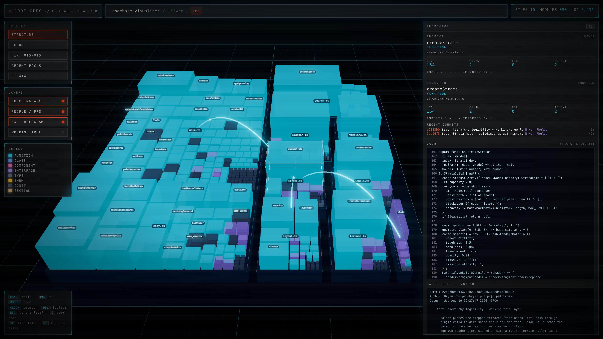

# Code City — codebase visualizer

A 3D "code city" for any TypeScript/JavaScript repo, rendered as a retro-futuristic hologram with [Three.js](https://threejs.org/).



*This repo's own `viewer/src` district: file blocks of module buildings, import arcs, and the inspector's live source pane. Generated by `npm run hero` — the visualizer analyzing and screenshotting itself.*

The metaphor: **folders are city blocks, files are plates, and every function, class, and component is a building** — styled by kind, heat-mapped by git churn, with live GitHub PR activity floating above the skyline.

The thesis: as more code is written by agents, we read less of it line-by-line. This is an instrument panel for keeping situational awareness of a codebase you no longer read — *where is the action, where does it keep breaking, who is working where*.

## Features

- **City hierarchy** — repo → folder districts → file blocks → module buildings → (double-click) class members. Folder plates are **stepped terraces**: top-level districts sit visibly raised, and every nesting level is a shallower step on top of its parent. Double-click isolates and breaks down any level; Esc / breadcrumb chains the camera back out through each level it passes.
- **Strata massing** — at city level a file *is* its history: one slab per commit, so height = commits and footprint = the file's size at that commit. Every mode stands on the same stacks and only repaints them, so switching overlays never reshuffles the skyline. A second timeline handle sets the range, so dragging it back grows the city out of its own history. Module buildings return the moment you isolate a file.
- **Overlays** — structure (the file's dominant module kind; the kinds themselves resolve inside a file), churn (12-month commit heat), fix hotspots (bug-fix commits), recent focus (touched in the last 30 days — the default), and strata (each level colored by its conventional-commit type: feat cyan, fix red, refactor violet…).
- **Strata filter** — in Strata the legend's type swatches are the controls: click `fix` and every fix level stays vivid while the rest ghost to silhouettes; hit **only** and the stacks recompress to their fix commits alone, turning the skyline into pure bug-fix mass. Multi-select accumulates, it composes with the timeline range ("only fix strata in Q1"), the stats and inspector report the filtered counts, and Esc clears the filter before it backs out a level. "Fix hotspots" is now a shortcut into it.
- **People / PR layer** — open PRs as author avatars on light beams over the files they touch. Beam thickness scales with diff size, altitude with activity recency. Draft PRs render as orange scaffolding; files touched by 2+ PRs get red conflict cages.
- **Coupling arcs** — directional import edges (animated flow importer → imported), aggregated per package when nothing is selected.
- **History timeline** — scrub or play through the commit stream and watch activity flow across the city.
- **Working-tree layer** — what is uncommitted *right now*: the unchanged city ghosts while modified files paint green↔red by their line balance, untracked files rise as cyan under-construction blocks, and deletions leave red vacant lots — with the change list in the sidebar (click to fly there) and a refresh button. On by default (a clean tree renders normally); dev server only.
- **Inspector sidebar** — stats, open PRs (one compact line each, click to expand), recent commits, and actual source/diff snippets for the selected node (dev server only).
- **Guided tours** — a tour is a JSON file (hand-written, or emitted by a coding agent that just read a PR) that flies the camera through 5–10 places in the code, isolating or highlighting each one and narrating it in the sidebar, with diffs, screenshots and links attached. See [Loading a tour](#loading-a-tour) and [docs/tours.md](docs/tours.md).
- **Map-style labels** — names scope dynamically to what's in view, districts → files → buildings, like a map engine. The top folder tiers are signed on their terrace side walls instead, holding a readable size from the org overview down to a close-up; every label is clickable (click selects, double-click isolates) and links to its children when you hover it.
- **Search** — `⌘P` for paths and modules, `⌘F` for file contents; matches glow and the rest of the city dims. The `⌘F` hits stay in the sidebar after the palette closes: click a file to fly there, unfold it for its matched lines, click a line to open the source at that span.

All analysis is local: the analyzer runs on your machine and the data never leaves it. The only network calls are optional `gh` PR lookups and GitHub avatar images.

## Quick start

```bash
npm install

# analyze a repo (writes viewer/public/data.json)
npm run analyze -- /path/to/your/repo            # analyzes the whole repo by default
npm run analyze -- /path/to/repo --roots src,lib # custom roots
npm run analyze -- /path/to/repo --no-prs        # skip GitHub PR lookup

# launch the viewer
npm run dev
```

Requirements: Node 20+, git; optionally the [`gh` CLI](https://cli.github.com/) (authenticated) for the PR layer.

## Controls

| Input | Action |
|---|---|
| Drag / middle-drag / wheel | Orbit / pan / zoom |
| Hover | Inspect in sidebar (a hovered node links to its children's labels) |
| Click | Select (pin details, coupling arcs) — plates, buildings, labels and terrace signs all pick |
| Double-click | Isolate + break down that node |
| Esc / breadcrumb | Clear an active strata filter, else back up a level |
| Legend swatch (Strata) | Filter the stacks to that commit type; **only** collapses them to it |
| `⌘P` / `⌘F` | Find a file or module / find in file contents |
| `C` | Copy the selected node's repo-relative path |
| `←` / `→` / `Esc` | Tour only: previous step / next step / exit the tour |

## Loading a tour

Three ways in, all of them validated through `validateTour` in
[`shared/tour.ts`](shared/tour.ts) — tour files are untrusted input, so
narration renders as plain text and artifact URLs are scheme-checked:

```bash
# 1. query param — relative, same-origin .cctour / .json paths only
npm run dev            # then open http://localhost:5173/?tour=tours/welcome.cctour

# 2. drag a .cctour tour file anywhere onto the window

# 3. live injection, from the console or an agent bridge
#    window.cityTour.load({ title: "…", steps: [ … ] })
```

While a tour plays: `←` / `→` step, `Esc` exits, and the bottom-left panel has
prev / next / autoplay (~8s a step, pauses as soon as you touch the camera) /
exit. Exiting restores the city exactly as it was.

The bundled `viewer/public/tours/welcome.cctour` is a tour of **this** repo's own
architecture, so it expects `npm run analyze -- .` first. To write your own — or
to have an agent write one for a PR — see [docs/tours.md](docs/tours.md).

## How it works

- `analyzer/analyze.ts` — walks the repo, extracts top-level modules (and class/interface/enum members) with the TypeScript compiler API, mines churn/fix/recency and the full commit stream (with per-file `[adds, dels]`) from a single `git log --numstat` pass — cached incrementally, so re-runs only read `<cachedHead>..HEAD` — resolves import edges (including monorepo workspace packages), and pulls open PRs via `gh`. Output is one JSON file; schema in [DESIGN.md](DESIGN.md).
- `viewer/` — Vite + Three.js. Squarified-treemap layout, instanced meshes (tested at ~17k buildings / 60fps+), UnrealBloom postprocessing, and a small dev-server API that serves source snippets and diffs from the analyzed repo (path-contained, localhost only).

## Development

```bash
npm run dev     # vite dev server (source/diff API enabled)
npm run build   # production bundle
npm run export  # static bundle in viewer/dist (bakes in the current data.json)
npm run typecheck # tsc --noEmit
npm run hero    # regenerate docs/hero.png
```

`npm run hero` (`scripts/hero.mjs`) analyzes this repo, boots the viewer, drives
headless Chromium through the drill-down, and writes the README image. It stashes
and restores any existing `viewer/public/data.json`, so the repo you were looking
at survives the run. It needs Chromium once: `npx playwright install chromium`.

## Design notes

See [DESIGN.md](DESIGN.md) for the full metaphor, data contract, and style guide. Ancestry and lessons borrowed from [CodeCity](https://wettel.github.io/codecity.html), EvoStreets, TeamWATCH, [Gource](https://gource.io/), and [ExplorViz](https://explorviz.dev/).

## Status

Early prototype, moving fast. Recently landed: the interactive Strata filter (legend swatches as a live query, with collapse-to-matching massing), a hierarchy-legibility pass (terraces, side-wall district signage, clickable labels, chained camera flights), the Working-tree layer, Strata as the shared massing across every mode, an incremental analyzer cache, guided tours, and markdown support. Current focus: core UX and fit & finish. Future: a VS Code extension over the existing `CityHost` seam (see DESIGN.md).
